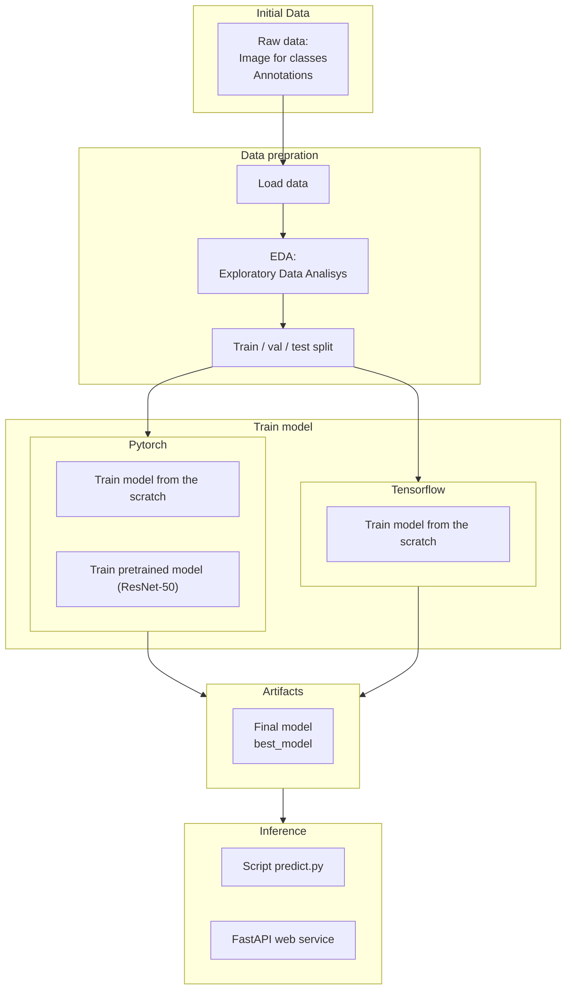

# Bin it right - trash classification

This project is capstone 1 assignment for [Machine Learning Zoomcamp 2025](https://datatalks.club/blog/machine-learning-zoomcamp.html)

## Problem

Streets of the modern western cities are filled with trash. 
Management and utility companies are struggling with cleaning it up, and automatic services are having troubles
in correct identification and sorting of the trash.
Is it possible to write an image classifier, that could help waste resycling facilities to easiliy clasify and categorize garbage by it is image? Let us find out!

## Objective

The goal of the project is to implement a image classifier, that will identify type of the garbage by the image

As an input, it expects a photo of the garbage, and as an output - predicted class and probabilities of belonging to other classes

## Dataset

* [Kaggle - Garbagle Classification dataset](https://www.kaggle.com/datasets/asdasdasasdas/garbage-classification) - contains example of images of 6 different classes:
  * `cardboard` (393)
  * `glass` (491)
  * `metal` (400)
  * `paper` (584)
  * `plastic` (472)
  * `trash` (127).

## Project's diagram



## EDA

More on EDA you can find in dedicated [notebook](./notebooks/02_eda.ipynb)

* All images have the same size
* The highest birghtness in `plastic` class

## Model selection

For studying purposes, this project is implemented with two options of [Pytorch](https://pytorch.org/) framework:
* Raw model
* Pretrained ([ResNet-50](https://docs.pytorch.org/vision/main/models/generated/torchvision.models.resnet50.html)) model

## Evaluation metrics

* [Accuracy](https://scikit-learn.org/stable/modules/generated/sklearn.metrics.accuracy_score.html#accuracy-score) (overall classification accuracy)
* [Balanced accuracy](https://scikit-learn.org/stable/modules/generated/sklearn.metrics.balanced_accuracy_score.html#balanced-accuracy-score) (macro-averaged recall)
* Macro-averaged [F1-score](https://scikit-learn.org/stable/modules/generated/sklearn.metrics.f1_score.html#f1-score)
* Weighted [F1-score](https://scikit-learn.org/stable/modules/generated/sklearn.metrics.f1_score.html#f1-score)
* Micro-averaged [F1-score](https://scikit-learn.org/stable/modules/generated/sklearn.metrics.f1_score.html#f1-score)
* Macro-averaged [Precision](https://scikit-learn.org/stable/modules/generated/sklearn.metrics.precision_score.html#precision-score)
* Macro-averaged [Recall](https://scikit-learn.org/stable/modules/generated/sklearn.metrics.recall_score.html)
* [Matthews Correlation Coefficient](https://scikit-learn.org/stable/modules/generated/sklearn.metrics.matthews_corrcoef.html#matthews-corrcoef) (MCC)

## Project structure

```
.
├── bin_it_right                       <- Main application package
│   ├── api.py                         <- API service definition
│   ├── config.py                      <- Application config
│   ├── dataset.py                     <- Dataset classes
│   └── modeling                       <- Tensorflow / Pytorch model-related files
│       ├── classifier.py              <- Classification service
│       ├── image_transformers.py      <- Image transformations
│       ├── predict.py                 <- CLI predict script
│       ├── pytorch.py                 <- Pytorch model
│       ├── tensorflow.py              <- Tensorflow model
│       └── train.py                   <- CLI train script
├── data
│   └── interim                        <- Intermediate data that has been transformed.
│   └── raw                            <- The original, immutable data dump.
│   └── processed                      <- The final, canonical data sets for modeling.
├── docker-compose.yaml                <- Docker compose services definitions
├── Dockerfile                         <- Dockerfile setup
├── kind-config.yaml                   <- Configuration of kind deployment
├── kubernetes                         <- Kubernetes configurations
│   ├── base
│   │   ├── deployment.yaml            <- Base deployment 
│   │   ├── kustomization.yaml         <- Kustomization config
│   │   └── service.yaml               <- Base service 
│   └── overlays                       <- Deployment alterations for different providers
│       ├── gke
│       │   ├── kustomization.yaml     <- Kustomization config for Google Kubernetes Engine
│       │   └── service-gke.yaml       <- Service definition for Google Kubernetes Engine
│       └── kind
│           ├── kustomization.yaml     <- Kustomization config for Kind
│           └── service-kind.yaml      <- Service definition for Kind
├── Makefile                           <- List of commands for simplifications of the calls
├── notebooks                          <- Jupyter notebooks
│   ├── 01_etl.ipynb                   <- Load data from sources; Form DataFrames
│   ├── 02_eda.ipynb                   <- Exploratory data analysis
│   ├── 03_pytorch_pretrained.ipynb    <- Pytorch pretrained model
│   ├── 03_pytorch_raw.ipynb           <- Pytorch raw model
│   ├── 03_tensorflow_pretrained.ipynb <- Tensorflow pretrained model
│   └── 03_tensorflow_raw.ipynb        <- Tensorflow raw model
├── pyproject.toml                     <- Project configuration file with package metadata
├── README.md                          <- Documentation of the project
```

## API Contract

### Classify image

#### URL

* `POST /{model_type}/predict`
  * `model_predit` is enum:
    * `raw` - raw model
    * `pretrained` - pretrained model

#### Request

```bash
curl -X 'POST' \
  'http://localhost:8080/raw/predict' \
  -H 'accept: application/json' \
  -H 'Content-Type: multipart/form-data' \
  -F 'file=@<file_name>;type=image/webp'
```

#### Response

```json
{
  "pred_class": "metal",
  "classes": {
    "glass": 0.0000041972912185883615,
    "paper": 0.014476404525339603,
    "cardboard": 0.000016134254110511392,
    "plastic": 0.000027249167033005506,
    "metal": 0.9854723811149597,
    "trash": 0.0000036398980682861293
  }
}
```

## Run

In order to run the project, it is necessary to install

* [Docker](https://www.docker.com/)
* [docker-compose](https://docs.docker.com/compose/)
* [uv](https://docs.astral.sh/uv/)
* [Make](https://www.gnu.org/software/make/)

### Makefile

This file is used for simplification of the running process

```makefile
install-kernel:
	uv run python -m ipykernel install --user --name=bin-it-right --display-name="Trash images classification project"

api:
	docker-compose up api

jupyter:
	docker-compose up jupyter

mypy:
	uv run mypy bin_it_right/

black:
	black --check bin_it_right/

black-fix:
	black bin_it_right/

ruff:
	ruff check bin_it_right/ --fix

lint:
	make mypy && make black && make ruff

train-cli:
	python -m bin_it_right.modeling.train $(dataset_path) $(model_path) --model $(model) --model-provider $(model_provider) --epochs $(epochs)

predict-cli:
	python -m bin_it_right.modeling.predict $(model_path) $(image_path) --model-type $(model_type)
```
  
### API

#### Local

* `uv sync`
* Activate virtual environment via `source .venv/bin/activate`
* `python -m bin_it_right.api --host 0.0.0.0 --port ${PORT:-8080}`
* Go to http://localhost:8080/docs - it would open Swagger interface for verifying the API calls

#### Docker

* `make api`

### Jupyter notebooks

#### Local

* `uv sync`
* Activate virtual environment via `source .venv/bin/activate`
* Create kernel via `make install-kernel`
* Select given kernel in Jupter Notebooks
  
#### Docker

* It is possible to run Jupyer Notebooks with docker-compose: `make jupyter`

### CLI

* `make train` - trains model
* `make predict` - performs predictions
  * Should be executed after training of model via make train

## Deployment

### Kind

0. Install [Kind](https://kind.sigs.k8s.io/)
1. Build Docker image:

```bash
docker build -t bin-it-right-api:latest -f Dockerfile .
```

2. Create Kind cluster:

```bash
kind create cluster --name bin-it-right --config kind-config.yaml
```

3. Load image to cluster:

```bash
kind load docker-image bin-it-right-api:latest --name bin-it-right
```

4. Apply Kubernetes manifests:

```bash
kubectl apply -k kubernetes/overlays/kind
```

### Google Kubernetes Engine

0. [Install](https://docs.cloud.google.com/sdk/docs/install-sdk) `gcloud` cli untility.
   
1. Enable API in GCP console. Required APIs are:
   1. Artifact Registry
   2. Cloud Build
   3. Google Kubernetes Engine
   4. Compute
   5. Containers

Also, make sure, that `gcloud` account owner has role `Cloud Build Service Account` (for local triggering of the build)

1. Authenticate

```bash
gcloud auth login
gcloud config set project $PROJECT_ID
gcloud config set compute/region $REGION
```

2. Create Artifact Registry repository:

```bash
gcloud artifacts repositories create bin-it-right \
  --repository-format=docker \
  --location=$REGION \
  --description="Bin it right images"
```

3. Tag and push docker image:

Using gcloud since GKE has AMD architecture and locally build images _might not_ be suitable

```bash
gcloud builds submit \
  --tag ${REGION}-docker.pkg.dev/${PROJECT_ID}/bin-it-right/bin-it-right-api:latest .
```

4. Create GKE cluster


```bash
gcloud container clusters create bin-it-right-cluster \
  --zone=$REGION \
  --num-nodes=1

gcloud container clusters get-credentials bin-it-right-cluster \
  --zone=$REGION \
  --project $PROJECT_ID
```

5. Apply Kubernetes manifests

```bash
kubectl apply -k kubernetes/overlays/gke
```

6. Retrieve service via `kubectl get svc`
7. Access the service via service's IP