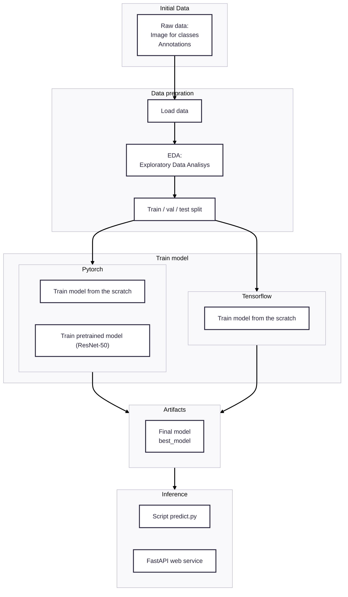

# Bin it right - trash classification

This project is capstone 1 assignment for [Machine Learning Zoomcamp 2025](https://datatalks.club/blog/machine-learning-zoomcamp.html)

## Problem

Streets of the modern western cities are filled with trash. 
Management and utility companies are struggling with cleaning it up, and automatic services are having troubles
in correct identification and sorting of the trash.
Is it possible to write an image classifier, that could help waste resycling facilities to easiliy clasify and categorize garbage by it is image? Let us find out!

## Objective

The goal of the project is to implement a image classifier, that will identify type of the garbage by the image

As an input, it expects a photo of the garbage, and as an output - predicted class and probabilities of belonging to other classes

## Dataset

* [Kaggle - Garbagle Classification dataset](https://www.kaggle.com/datasets/asdasdasasdas/garbage-classification) - contains example of images of 6 different classes:
  * `cardboard` (393)
  * `glass` (491)
  * `metal` (400)
  * `paper` (584)
  * `plastic` (472)
  * `trash` (127).

## Project's diagram



## EDA

## Model selection

## Evaluation metrics

## Project structure

## API Contract

## Run

## Deployment

### Kind

0. Install [Kind](https://kind.sigs.k8s.io/)
1. Build Docker image:

```bash
docker build -t bin-it-right-api:latest -f Dockerfile .
```

2. Create Kind cluster:

```bash
kind create cluster --name bin-it-right --config kind-config.yaml
```

3. Load image to cluster:

```bash
kind load docker-image bin-it-right-api:latest --name bin-it-right
```

4. Apply Kubernetes manifests:

```bash
kubectl apply -k kubernetes/overlays/kind
```

### Google Kubernetes Engine

0. [Install](https://docs.cloud.google.com/sdk/docs/install-sdk) `gcloud` cli untility.
   
1. Enable API in GCP console. Required APIs are:
   1. Artifact Registry
   2. Cloud Build
   3. Google Kubernetes Engine
   4. Compute
   5. Containers

Also, make sure, that `gcloud` account owner has role `Cloud Build Service Account` (for local triggering of the build)

1. Authenticate

```bash
gcloud auth login
gcloud config set project $PROJECT_ID
gcloud config set compute/region $REGION
```

2. Create Artifact Registry repository:

```bash
gcloud artifacts repositories create bin-it-right \
  --repository-format=docker \
  --location=$REGION \
  --description="Bin it right images"
```

3. Tag and push docker image:

Using gcloud since GKE has AMD architecture and locally build images _might not_ be suitable

```bash
gcloud builds submit \
  --tag ${REGION}-docker.pkg.dev/${PROJECT_ID}/bin-it-right/bin-it-right-api:latest .
```

4. Create GKE cluster


```bash
gcloud container clusters create bin-it-right-cluster \
  --zone=$REGION \
  --num-nodes=1

gcloud container clusters get-credentials bin-it-right-cluster \
  --zone=$REGION \
  --project $PROJECT_ID
```

5. Apply Kubernetes manifests

```bash
kubectl apply -k kubernetes/overlays/gke
```

6. Retrieve service via `kubectl get svc`
7. Access the service via service's IP